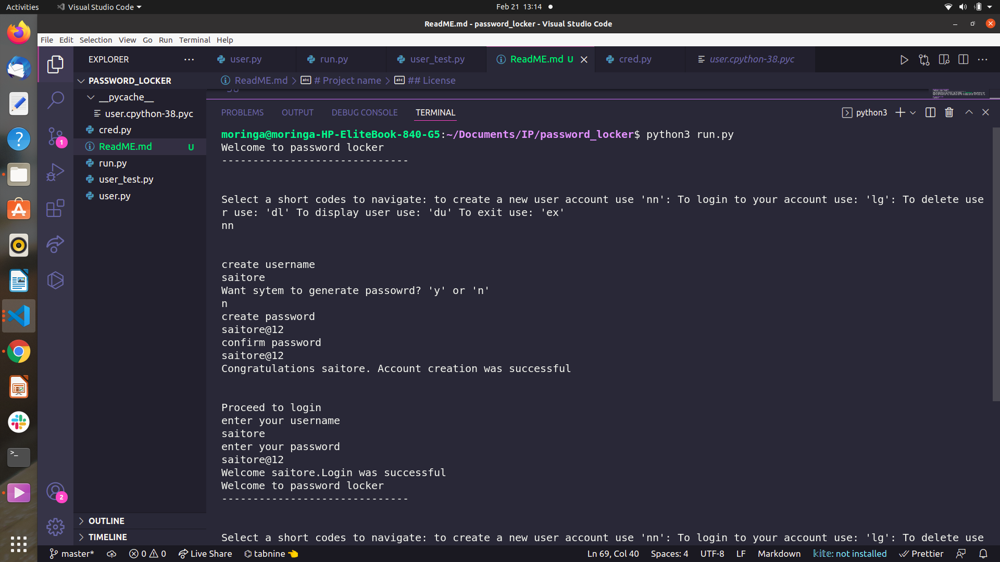
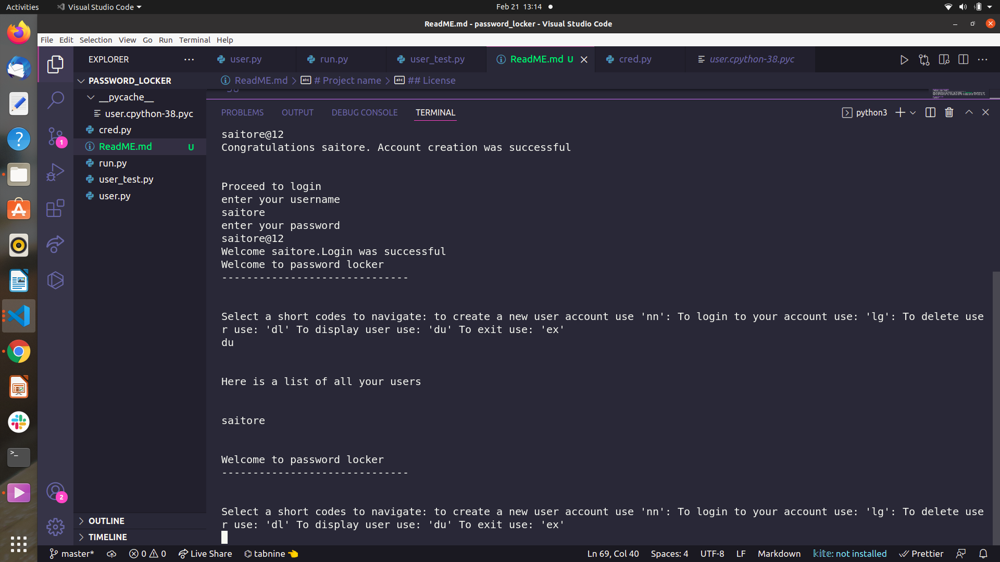

# Project name
*Password_locker

## Author

*Saitore Virginia


## Description

This project is a python application that manages login and signup credentials of a person for various accounts i.e. username and passwords for each account. It also stores the passwords and generates a unique password for a user if they do not want to generate new passwords by themselves.

## Screenshot




## User Stories
The user would like to.... :
* To create an account for the application or log into the application.
* Store my existing acounts login details for various accounts that i have registered for.
* Generate new password for an account that i haven't registered for and store it with the account name.   
* Delete stored account login details that i do now want anymore.
* Copy credentials to the clipboard


## Installation / Setup instruction

#### The application requires the following installations to operate 
* python3.6
* pyperclip
* pip

#### Cloning

* Open Terminal {Ctrl+Alt+T}

* git clone ```https://github.com/Saitore973/password_locker.git```

* cd Password-Locker

* code . or atom . based on the text editor you have.

### Running the Application
* To run the application, open the cloned file in terminal and run the following commands:

        $ chmod +x interface.py
        $ ./interface.py
* To run test for the application
        $ python3 passlock_test.py

## Behaviour Driven Development
| Behaviour | Input | Output |
| :---------------- | :---------------: | ------------------: |
|Open the application on the terminal | Run the command ```$ ./interface.py```|Hello Welcome to your Accounts Password Store.Select a short codes to navigate: to create a new user account use 'nn': To login to your account use: 'lg': To delete user use: 'dl' To display user use: 'du' To exit use: 'ex'

## Technologies used
* python3.6


## Known Bugs
* There are no known bugs currently but pull requests are allowed incase you spot a bug

## Contact Information 

If you have any question or contributions, please email me at [saitorevg@gmail.com]

## License
* *MIT License:*
* Copyright (c) 2019 **Saitore Virginia**

